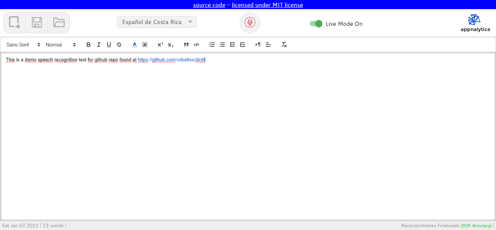

# dictit

Dictation Tool Based On Speech API, BlobJS, FileSaverJS and QuillJS with speech to text recognition, editor and file export as docx.

**Note:** Currently it works only in Google Chrome and does not store nor send any data to any servers, it works only on the curren user's session so if the user does not export the document and closes the browser/tab the current work will be lost and unrecoverable.

**Demo:** [Here](https://dictation.appnalytica.com) (Open It in Google Chrome)

**What's next:** I am thinking on making some changes to this as follows and when I have the available time:

 - Migrate to bootstrap 4 to make it responsive.
 - Add local storage (indexeddb) storage to prevent the user from losing the date on browser/tab closing.
 - Add some server side code (php) to sync documents or keep them online for review using simple accounts.
 - Add multi-language support/locales
 - Other bugfixes

**Credits:**
[QuillJS](https://github.com/quilljs/quill)
[BlobJS](https://github.com/jimmywarting)
[FileSaverJS](https://github.com/eligrey/FileSaver.js/)
